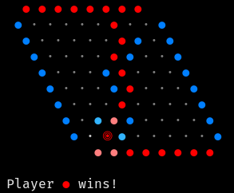
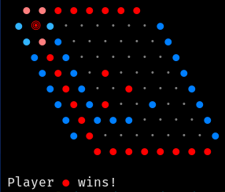

# Hex Game with Monte Carlo Tree Search

This repository contains an implementation of the Hex board game, which utilizes Monte Carlo Tree Search (MCTS) for its AI agent. The game is written in C# and provides a console-based interface for playing against the AI or another player. It also provides a friendly CLI with subtle highlighting of neighboring cells.

## Game Description

Hex is a strategic board game for two players. The game is played on a hexagonal grid, where players take turns placing a stone of their color on a single cell within the overall playing board. The objective is to form a connected path of your stones linking the opposing sides of the board marked by your color.

## Hex Rules
Hex is a two-player abstract strategy board game played on a rhombic grid of hexagons, typically of size 11×11, although other sizes are also possible. Each player is assigned a pair of opposite sides of the board, which they must try to connect by alternately placing a stone of their color onto any empty hex. Once placed, the stones are never moved or removed. The first player to form a connected path of their counters linking the opposing sides of the board wins the game.

## AI Agent

The AI agent uses Monte Carlo Tree Search to decide on moves. MCTS is a heuristic search algorithm for some kinds of decision processes, most notably those employed in game play. The AI will simulate random games from the current state, evaluate the outcomes, and choose the move that leads to the most favorable results. Unfortunately, it is kinda suboptimal currently, working quite well on smaller boards (10x10). Run the program with command line argument "bot" in order to play with agent.

## Dependencies

The game is built using the .NET framework and requires no external dependencies other than the standard library.

## License

This project is open-source and available under the MIT license.
